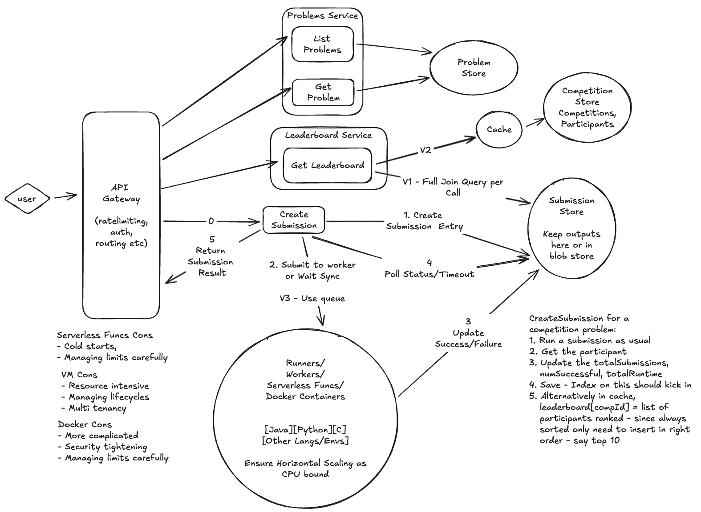

# Design LeetCode

## Requirements (~5 minutes)

### Functional Requirements (~2-3 minutes)

The functional requirements are:

1. View list of problems
2. View problem details
3. Submit solution for a problem and get feedback
4. Participate in competitions
5. Leaderboard for competitions

Scale Requirements:
* 30M MAU - ~ 1M DAU
* Each user say performs 100 submissions a day - 100M submissions a day
* May be 1 competition a day?

### Extensions (Out of scope)

Functional:
1) No creations/deletions of problems (admin)
2) Compliance/CSAM/Audit checks for solutions or contents
3) Analytics - For the entities a user creates what kind of analytics can be done.  Typical are - top N kind of problems.
4) Authentication/Access Control - user management
5) Language agnostic for now - though our solution is extensible to various language
   runtimes/worker types
6) User profiles
7) Commenting/Discussion boards, social features etc
8) Lookup by slug ID

Non Functional:
1) Observability - So we can ensure reliability, uptime, attacks etc
2) Disaster recovery - comes under reliabiliability and is a great way to go into which parts are "effectful" and which arent.
3) CI/CD, Deployability, Experimentation

Both:
1) Tiered SLOs (usage/pricing/billing etc)

### Non functional requirements (~2-3 minutes)

* Isolation of code (just mention)
  * File system - readonly
  * CPU/Memory bounds per problem etc
  * Timeouts
  * Limited network access
  * No system calls
* Availability - Very important - if users cannot view problems or problem details it is a problem.
* Consistency - Eventual consistency on score board - but as high freshness as possible.
* Submissions and execution results within 5s
* Freshness - how fresh is the data user is seeing (ie if user is seeing prices from a 3P system, what SLO do we want on the freshness - would affect their purchase decisions)
* Scalable:
  * Competitions with 100k users participating/observing leaderboards
  * 100M submisisons a day to run within 5 seconds

## API/Interface/Entities (2-3 minutes)

### Entities

```
record User {
  id string
}

record Competition {
  compId string
}

record Participant {
  // shard key (if need to shard by this - though given 1 competiton per day - not *that*
  // may competitions around.
  compId string   
  
  // unique - userId + compId (can also be pkey if needed)
  userId string   
  
  // rank of user in the competition 
  // assume this is either computed when stats like number problems solved,
  // or submissions are scored and times etc
  rank int
  
  // Some materialized details about the submission (for V2)
  totalSubmissions int
  successfulSubmissions int
  // sum of all start to end times across all problems
  totalTime int             
  // can keep submission IDs for quick eval of things
  submissionIds []string  
}

record Problem {
  id string
  title string
  description string
  createdAt: Timestamp
  updatedAt: Timestamp
  
  // others
  // code stubs for various languages
  // test cases - inputs and expected results - may be private/public etc
  // tags []string
  // difficulty int
}

recored Submission {
  id string
  problemId string
  userId string
  compId string   // if the submission was part of a competition
  results URL   // pointer to results - can be in a blob
  success bool  // pass or fail - can be more detailed on a per case level etc -
                // but keep it simple for now
  submittedAt Timestamp
  details any   // things like memory, runtime etc
}

record LeaderBoard {
  compId string
  rankedUsers []UserId
}
```

### Services/APIs (~5 minutes)

```
service ProblemsService {
  ListProblems(offset, count int) (results []Problem, nextOffset int) {
    GET /problems?....
  }
  GetProblem(problemId string) (Problem) {
    GET /problems/{problemId}
  }
  CreateSubmission(problemId string, code string) (Submission) {
    POST /problems/{problemId}/submissions
  }
}

service CompeittionService {
  GetLeaderBoard(competitionId string) LeaderBoard {
    GET /competitions/{competitionId}/leaderboard
  }
}
```

## High Level Design (~ 5-10 minutes)



<a href="https://excalidraw.com/#json=FjHc5-pd-AV6XsP-sfI9Y,eXh2Fe6JogqeevkHsPBNpg"
target="_blank">Edit</a>

## Deep Dives

See HLD for:

1. how to do CreateSubmission for competition
2. How to scale workers
3. Kind of worker runtimes
4. Cache for Competition Store
