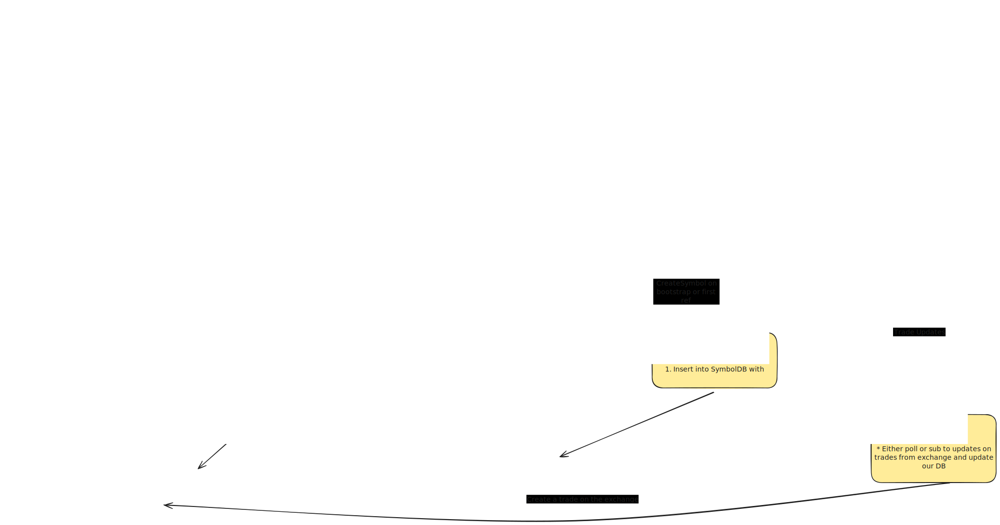

# Design RobinHood

## Description 

Robinhood is a commission-free trading platform for stocks, ETFs, options and cryptocurrencies.   Its features include real time market data and basic order management.  It is not an exchange on its own but rather a broker - it routes trades through market makers - ie exchanges and is compensated by those exchanges via a process called "payment for order flow".   Il now share some of the requirements for a V1 of the system and we can evolve it as we see fit.  How does that sound?

--- 

## Requirements

### Functional Requirements

A few functional requirements are:

1. User should be able to see the prices of selected symbols - as fresh as possible.
2. Users should be able to create trades - which will be brokered by robinhood and acknowledged by exchanges.
3. Users should be able to list/see all their current and past trades.

As to some numbers, I am going to assume about 20M DAU, with each user making about 5 trades on average per day.   Also I am going to assume the number of stock symbols in the system is about 5000 (a google search has revealed NASDAQ has about 5k symbols for US stock).   I am also going to assume since users will be researching prices before purchasing a user may make about 50-100 symbol price fetches a day.

### Out-of-scope/Extensions (Should be mostly standard but call out Sys specific ones)

System Specific:
1) Creation involves submitting a trade to HOOD - and we arent yet guaranteeing it will be accepted.   Trade's "status" will reflect where it is at and could take a while.

Functional:
1) While exchanges send updates via WS, we wont yet provide the same functionality from RH -> User.  User would have to refresh/poll for simplicity in V1.
2) Getting multiple symbols in one call.
3) Auditability/Compliance - especially for user generated entities (trades - are they legal, posts - CSAM?, blogs - copyright etc)
4) Analytics - For the entities a user creates what kind of analytics can be done.  Typical are - top N kind of problems.
5) Authentication/Access Control - user management

Non Functional:
1) Observability - So we can ensure reliability, uptime, attacks etc
2) Disaster recovery - comes under reliabiliability and is a great way to go into which parts are "effectful" and which arent.
3) CI/CD, Experimentation, Rollouts etc

Both:
1) Tiered SLOs (usage/pricing/billing etc)

How does this sound?   Are there other cases you would like to cover?   Otherwise I can proceed to some non-functional requirements

### Non Functional Requirements

Qualitatively we want to ensure a few things:

1. High need for consistency - trades accepted by the exchange must not be lost.  Once the user has successfully submited a trade, it should be visible in their listings.
2. The freshness must be high - ie we want to ensure user has as recent prices as possible.
3. Since the exchange exposes a websocket type of connection for streaming stock prices we want to ensure the number of connections are minimized to be cost effective for the platform

Now to put some (p90) SLOs around this,

Latency/Freshness Targets:
* We want our stock prices freshness to be within 1-5 seconds for ensuring users have a reasonably high confidence in their trades.   Given we are not building a HFT platform I think this is a reasonable SLO.
* Trades should be submitted to Robinhood with say 100ms - 1s latencies.   Note that Robinhood may asynchronously work with exchanges to accept/reject trades.  But once accepted by robinhood it should be persistent in user listings.
* User trade listing should be within 100ms so that UX is snappy.

Throughput and Scability:

* Given 20M DAU and 5 traders per user - we are looking at about 100M trades a day - roughly 1000 trades submitted per second (roughly assuming 100000 seconds a day).
* Similarly a 20M user making around 100 price checks a day - translates to 20B prices checks a day - about 20k checks per second.
* Similarly a user may check for their own trades perhaps 10 times a day - needing 200M self-trade listings per day or 2k listings per second.
* For trades the system is read heavy.  For Symbols the system is both read and write heavy.    However number of symbols in the system is low - about 5000 so we are expecting "high" updates per symbol.   

Availability and Fault Tolerance

* Users can be geographically dispersed (even within US there are several regions).
* Expect system to be fault tolerant (and avoid any single point of failures).   Availability SLO should be 5 9s (4 minutes of downtime per year)

--- 

## Entities/APIs/Services

### Entities

**Plain Version**

In this version - we will call out what we exluded and why.  In the next version we will have somethign that addresses the exclusions too.

```
Currency = float64
UserId = string

record Symbol {
   id string # Primary Key - < 10 chars
   lastUpdated Timestamp
   Price  Currency
   // Other info like description, company url etc
}

record Trade {
   tradeId string.     # primary key
   symbolId string.     # symbol being traded on
   createdBy UserId
   createdAt Timestamp
   updatedAt TimeStamp
   status string      // for compliance reasons and au
   // other info like trade type, min/max prices etc
   
   Metadata Json        // for compliance, auditing, etc
}

record User {
   userId string # Primary Key
   // Other user details like name, email, etc
}
```

**Possible Pushback:**

* For the Trade record, will you incorporate fields for order quantity, trade
  type (buy/sell), or price limits? These details might be crucial in ensuring
  precise trade management.
* Regarding the Symbol record, since you’re dealing with high-frequency updates
  from the websocket connection, how do you plan to manage potential update
  conflicts or ensure consistency with the persistent storage?
* Lastly, will any additional metadata be stored for auditing purposes or
  tracking trade lifecycle events (e.g., accepted, rejected, partially filled)?

So address this preemptively with why you are excluding them before this comes back:

1. For the Trade we will not include fields like quantity, type, price etc as I
   am considering that to be part of the "other info" and for now I dont
   anticipate how our API will work.  We can revisit this as we see our system
   evolves.
2. For the Symbol - we will have high amount of updates (as freshness needs
   increase).   We are for now excluding fields/primitives (such as versions
   for optimistic locking) and will revisit this after our high level design
   and a deep dive into correctness and performance.
3. Also we could store additional metadata for auditing purposes but since we
   called that out as out-of-scope we are ok with excluding it here.

**GOOD INTERVIEWER ACK**

```
Your entity design is a solid starting point—it’s clean and captures the core
elements we need for V1. I appreciate how you've kept the design flexible by
deferring some of the more detailed aspects like trade quantity and the
specifics of optimistic locking for Symbol.
```

Watch for "impatience", eg along with ack, interviewer may be asking you to also explain things about the system beyond just API, eg

```
Fetching Real-Time Prices:
How would you design the API for retrieving symbol prices, considering the high
frequency of updates? What mechanisms might you put in place to ensure
freshness (within 1–5 seconds) while managing the cost implications of the
websocket connections from the exchange?

Trade Submission:
What does the endpoint for creating a trade look like? Given that trades are
accepted asynchronously by Robinhood (and later by exchanges), how do you plan
to ensure that once a trade is accepted, it’s reliably persisted and visible to
the user? How would you handle the potential delays or retries?

Listing User Trades:
How would you design the endpoint for retrieving a user’s current and past
trades to ensure a fast (sub-100ms) and consistent response?
```

You might want to say when you are proposing the API that after API - HLD is about to come...

### Services/Endpoints

```protobuf
service SymbolService {
    GetSynbol(symbolId  string) Symbol {
        GET /symbols/{synbolID}
    }
    UpdateSymbol(synbolId string, updatedSymbol Symbol) {
        PUT /symbols/{synbolID}
        body: updatedSymbol
    }
}

record PaginatedTrades {
    trades []Trade
    offset int
    count int
    totalTrades int
}

// All calls ensure authentication and apply to the authenticated user only,
// Admin endpoints out of scope
// All call can also return a non success response via errors (eg http or grpc)
service TradeService {
    ListTrades(userId string, offset, count int) PaginatedTrades {
        GET /trades
    }
    CreateTrade(trade Trade) {
        PUT /trades
        BODY: trade
        OnReturn: CreatedAt and Id are generated by server
    }
    DeleteTrade(tradeId) {
        DELETE /trades/{tradeId}
    }
    UpdateTrade(trade Trade) (updatedTrade Trade) {
        PUT/trades/{trade.Id}
    }
}
```

Now with this Id like to move on to the High Level Design and talk about what the major actors/components, how the functional requirements are satisfied and then we will move on to addressing, tradeoffs, scalability bottlenecks and how to address them.

### High Level Design



The main flow is:

* The user hits Robinhood's API Gateway
* The API gateway forwards the request to the appropriate API endpoints.
* ListTrade, CreateTrade, GetSymbol and GetLiveSymbols are public endpoints
* UpdateSymbol, UpdateTrade are private endpoints

ListTrade:

1. Fetches the trades from our trade DB for a given user
2. Note that we are currently on a single logical DB and have not addressed
   scale.  This shall be addressed later.

CreateTrade:
1. First a trade entry is created in the TradeDB - to reflect the user has created a Trade.
2. This also includes creating a tradeID - we can use several strategies for this (eg
   global counters, id generation service, and others.  We will not dive into this
   strategy for now).
3. Next the trade is submitted to the exchange.  Each Robinhood trade will also have an
   associated exchange side trade.  This is important as exchanges may have their own ID
   formats/conventions.  This is only created once the exchange has accepted and persisted
   a trade.
4. The trade is returned to the user.  Note that the trade's status (include exchange ID
   generation) can now be asynchronous (or performed each time a "ListTrades" is called
   for simplicity at the expense of latency).

UpdateTrade
1. This endpoint is primarily called by exchanges when trade statuses (including exchange side ID generation) are updated.
2. We assume exchange side trades hold metadata of our trades so RH side tradeID is available through which we can update the corresponding entry in the TradesDB.

ConnectionManager
1. Instead of our GetSymbol endpoint/service directly managing websocket connections we will centralize subscriptions to the ConnectionManager which will ensure that for a given symbol a websocket exists.
2. Doing this gives us the benefit of multiplexing multiple several symbols across a single websocket connection (assuming the exchange supports N symbols per websocket).
3. If exchanges only support 1 symbol/per connection then the connection manager can still maintain the connectionId <-> symbol pair and create/garbage collect connections as it sees fit (eg timeouts, least recently used symbols etc).
4. ConnectionManager as the termination point for websocket subscriptions through which it receives symbol updates with which it calls the UpdateSymbol endpoint.
5. This can also be used for listenign to trade updates if polling is staring to become inefficient.

GetSymbol/GetLiveSymbols
* First the ConnectionManager is notified of an "itnerst" in given symbol(s)
* This lets connection manager ensure symbols exist in SymbolDB along with kickingoff
websocket connections as allowed by the Exchange APIs.
* The first 2 steps can be asynchronous (and help with LRU if needed)
* Next read from the SymbolDB and return.

UpdateSymbol
1. Updates the symbol.
2. Should we use optimistic locking (ie Update if lastUpdated < updatedSymbol.Timestamp)?
   More on this later.

Firstly our Trades must be highly consistent so we are ok to have either a relational
store or a KV store for storing trades.  Choices:


### Deep Dives and Scalability - Component by Component

**API Server/Gateway**

* First the API server - great that it is a sing point of entry.  To ensure it doesnt become
a single point of failure make sure it is horizontally scalable (loadbalanced etc).
* Also these should be resilient to spikes in traffic (market conditions etc)

* Same with Symbol and Trade services (the API server).

**ConnectionManager**

Before we go to the datastores let us look at ConnectionManager.  The ConnectionManager is
responsible for managing websocket (or SSE) connections to listen to updates from the
exchange. 

Options for fault tolerance, HA
1. replicas - each maintaing set of connections with exchange (duplicate paths)
2. CM is stateless (it has a symbol -> conneciton mapping but that is also local) - even
   with 5000 connections (assuming exchange only allows 1 connection per symbol) - fairly
   solved problem - C5K.
3. CM can either use WS or SSE.  SSE is unidirectional, WS means we can send control
   messages to control what exchange sends etc - though increased complexity.

This does not need to be stateful - can be if we chose to partition certain symbols on
certain CMs - but at 5K not as necessary.  However at 50k symbols it may make sense to
have leader election to ensure which CMs are managing which symbol sets.

Spikes - eg market open events - for large symbol sets (5K may be ok) will mean better partitioning is needed.  Measure and expand first.

**DataFlow to Clients:**

For truly effective pushes we can also implement a push-to-client model (currently this is
near-real-time-polling) with a fanout mechanism, CM -> symbol S1 -> Clients C1..Cn
listening on S1 and so on.

**Latency:**

There is an inherent delay between receiving the update from the exchange, persisting to Symbol DB, and the user retrieving it. For your 1–5s freshness SLO, this might be acceptable. But you’ll need to carefully measure it under load.

#### Storage and DataStore constraints


**SymbolStore**

For the Symbol store - since data is ephemeral and constantly updated, having this be an
in-memory store (or cache) offers lowest latencies (10s of microseconds for inmemory
updates and thread locks).  And doing so on 5K symbols is fairly light.  

As number of symbols grows and with high number of reads (20MDAU => 1k symbol reads per
second) partitioning in a distributed cache (conssitent hashing) is helpful.

We can use a standard DB (or KV store) and write updates to an append-only log with writes
serialized into the DS - but freshness latency may still be a problem if we want something
< 1s.

**TradeStore**

The Trade store MUST be consistent and RYW consistent.  However growing volume is a
concern.  With 20M DAU and 5 traders per user per day - that is 100M traders per day.
In a year trades would be 36B trades.

A strong partioning scheme is required.   For a user we are looking at about 5 * 365 ~2K
trades per day.   Given most trade related queries are per-user, sharding our initial
TradeStore by user ID offers reasonable high scalability.   Multiple users can be
tenanted.   Each "user shard" needs to handle 5 writes and about 100 listings - ~ 100
read/write calls.   A typical DB node can handle 10k iops (0.1ms io latency).  So a
tradedb "user shard" can host about 10k/100 = 100 users (that too only with write
traffic).

This is not great for utilization (eg imagine using a datastore that is only 100 * 2000 *
1kb = 200mb) in size.

Instead what we want is use our resources effectively.   Since the ListTrades is extremely
read heavy we can either either use In-Memory caches or Read replicas:

**<u>In-Memory Cache (e.g., Redis)</u>**

**Benefit**: Offloads frequent reads (like “ListTrades”) from the primary DB.
**Trade-Off**: Must ensure consistency or near-consistency. If a user just created a trade, it must show up immediately in the cache.
Implementation Detail: You can update the cache synchronously right after a successful DB write, or use an event-based approach to invalidate/update cache entries.

**<u>DB Read Replicas</u>**

Benefit: Offload read traffic while preserving a single write-master for consistency.
Trade-Off: Potentially slight replication lag. If you need strict read‐your‐own‐writes, the user must read from the write-master (or use a short-lag replica with synchronous replication).

Eg for each replica, maintain a cache of the user's trade list (even at 2K entries and 1kb
per trade that is 2Mb per user).   With an in-mem cache a user's trades can be fetched in
~10 of microseconds (within system).   If we had 1000x the number of users in a shard (eg
100k users) that would be 100k * 2k * 1kb = 200Gb of storage per disk (pretty reasonable -
enterprise disks can scale upto 16Tbs!).

**Managing Memory Footprint**

Storing all trades for 100k users (2 MB each) can indeed reach 200 GB in-memory. This might be acceptable on modern high-RAM nodes or a distributed cache cluster.

**Tiered Storage:** Keep only the most recent trades in memory (e.g., last 30 days) and
fetch older trades from the DB or a cold store on demand.  This significantly reduces hot
memory usage if most queries only concern recent activity.


<u>Problem with Hot Users:</u>

Some kind of partition/shard manager can ensure that hot users are not on the same tenant.
Mitigation: Dynamic rebalancing or a shard manager that can detect hot shards and migrate some users to other shards.

**Reliability and Fault Tolerance**

The CM could be on multiple regions (due to 5 nines) and each write to a local symbol
store (since it is in-mem anyway).

The TradeDB would have to be replicated geographically (for users globally).   Since write
QPS is low - replication lag/latency wont be the limiting factor (even with master-master
replication) - once replicated local regional instances' cache can handle local traffic.

