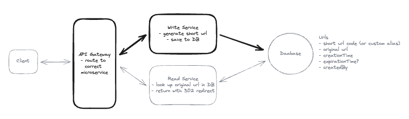

# Design <Product Name>

<span style="color: red">**Describe the problem here.  More info the better**</span>

Bit.ly is a URL shortening service that converts long URLs into shorter, manageable links. It also provides analytics for the shortened URLs.

## Requirements (~5 minutes)

### Functional Requirements (~2-3 minutes)

<span style="color: red">**Describe functional requirements here.  Few things to watch for.**</span>

<span style="color: red">**WARNINGS:**</span>

* Dont be too narrow - It is very easy to think about exactly what the problem and nothing else for context.   Doesnt mean you have to design a v100 problem on day one but understand possible user concerns here to guide why you are building the product and then go with what you are building so requirements are clearer and tangible.
* Dont be too generic - Very easy to build V100 of a product as you are just adding more and more requirements so you dont look dumb.  Keep it simple - just rounded.
* Depending on interviewer for input: Unless the interview starts off with a set of requirements, they are looking you to drive it so come up with things with your understanding of why (pretty much based on experience as an authority figure)

The functional requirements are:

1. User should be able to do 1, 2, 3
2. System should handle/allow 1, 2, 3
3. Any third party constraints (eg Robinhood connecting to exchanges)

Scale Requirements:

* This is usually quantity things to be met for SLO purposes, eg
* DAU,
* Number of entities created, listed, updated, deleted (on a Daily, Monthly basis)

### Extensions (Out of scope)

<span style="color: red">**WARNINGS:**</span>

At this point you may be asked for how about "X" - eg authentication, compliance, logging etc.  This is risky at senior levels as you are giving control back to the interviewer.

To circumvent that we can call out some out-of-scope things/extensions (eg we want to mention for showing our expertise on what a real world "production" service looks like).  Eg with something like:


"Before I go into NFR I want to call out some extensions that I would prefer not being in scope:"

Functional:
1) Auditability/Compliance - especially for user generated entities (trades - are they legal, posts - CSAM?, blogs - copyright etc)
2) Analytics - For the entities a user creates what kind of analytics can be done.  Typical are - top N kind of problems.
3) Authentication/Access Control - user management

Non Functional:
1) Observability - So we can ensure reliability, uptime, attacks etc
2) Disaster recovery - comes under reliabiliability and is a great way to go into which parts are "effectful" and which arent.
3) CI/CD, Deployability, Experimentation

Both:
1) Tiered SLOs (usage/pricing/billing etc)

If this is ok Id like to jump into the NFR and Operational requirements, especially where we deal with SLOs, Latency Targets, Availability, Scalability, Fault tolerance and others.

**NOTE** - To maximize silent-ack - Important to call out "where we deal with others...." so you are preempting the interviewer from saying what you are going to and ensure being in the driver seat.

### Non functional requirements (~2-3 minutes)

* Availability - Describe why availability is important - eg if user cannot access site they cannot warn dangers
  * Be ready to calculate error rates
* Consistency - eg if user bought something they want to see it in their orders otherwise it is problematic
* Freshness - how fresh is the data user is seeing (ie if user is seeing prices from a 3P system, what SLO do we want on the freshness - would affect their purchase decisions)
  * For both above freshness SLOs would be key.
  * Also call out RYW guarantees for user created entities (tweets, posts, trades etc)
* Scalable - Address scalability for the scale requirement numbers and SLOs on CRUD operations (again why it affects product/platform/user experience goodness)
* Geo capabilities - Part of scalability is address how users in various regions are affected etc.
  * Also has impact on freshness/consistency

<span style="color: red">**WARNINGS:**</span>

* Unless problem statement comes up with some quantitative requirement you have to provide some. This includes SLOs, QPSes, Usage numbers

Consider framing/grouping like below:

**Latency Targets:** What are your expectations for the response times for price updates and trade creation? How critical is near-real-time performance here?

**Throughput and Scalability:** With the estimated load, what kind of throughput numbers are you targeting, and how would you design the system to scale effectively?

**Availability and Fault Tolerance:** What measures would you implement to ensure the system remains highly available and can gracefully handle failures?

**GOOD EXPECTED INTERVIEWER ACK**
```
That sounds great. Let's move on to the API and entity design. Could you walk
me through your proposed API definitions—such as the endpoints for retrieving
real-time prices, creating trades, and listing a user's trade history—and
describe the core entities you'll use to model this system? Feel free to start
with any endpoint you prefer and explain your design choices.
```

## API/Interface/Entities (2-3 minutes)

### Entities

<span style="color: red">**WARNINGS:**</span>
* Some interviewers may ding you if you dont have a User entity - even though we are not dealing with Auth.  
* May be just mention "we have a User entity with userId and other details which we wont show here"

Next write up the Entities that address the use cases above.   Again dont go overboard but have common sense things covered, eg:

1. ID for primary key - be clear if this is string or long
2. Entities to have CreatedAt timestamp and CreatedBy (userid) fields.   
3. UpdatedAt is useful if updates are to be tracked etc
4. For optimistic locking think about version fields
5. Annotate fields with whether they are primary field or not
6. DONT GO OVERBOARD WITH INDEXES - leave it till later
7. Having a "metadata" field can be general purpose for auditing/compliance etc
8. Make sure to explain what you are "excluding":
  1. User entities
  2. Details that are beyond

eg for an Entity (in Bitly):
   
```
record URL {
  Id string `primaryKey, unique`
  LongUrl string    
  CreatedBy string
  CreatedAt TimeStmp
  ExpiresAt TimeStamp
}
```

**POSSIBLE PUSHBACK:**

* For record X - will you incorporate any details (eg for Trades order quantity, trade
  type (buy/sell), or price limits? These details might be crucial in ensuring
  precise trade management)
* Any details to manage potential concurrency and consigtency issues (eg version timestamps for optimistic lockign etc?)
* Any additional metadata be stored for auditing purposes or tracking lifecycle events (e.g., accepted, rejected, partially filled)?

Best way to address this is is to prempt it with our API specs by calling them out proactively, eg

1. For X we will not include fields like X, Y, Z as I am considering that to be part of the "other info" and for now I dont anticipate will affect how our API will work.  We can revisit this as we see our system evolves.
2. For high amount of (say updates) we are for now excluding fields/primitives (such as versions for optimistic locking) and will revisit this after our high level design and a deep dive into correctness and performance.
3. Also we could store additional metadata for auditing purposes but since we called that out as out-of-scope we are ok with excluding it here.

**GOOD INTERVIEWER ACK**

```
Your entity design is a solid starting point—it’s clean and captures the core
elements we need for V1. I appreciate how you've kept the design flexible by
deferring some of the more detailed aspects like trade quantity and the
specifics of optimistic locking for Symbol. 
```

Watch for "impatience", eg along with ack, interviewer may be asking you to also explain things about the system beyond just API, eg

```
Fetching Real-Time Prices:
How would you design the API for retrieving symbol prices, considering the high
frequency of updates? What mechanisms might you put in place to ensure
freshness (within 1–5 seconds) while managing the cost implications of the
websocket connections from the exchange?

Trade Submission:
What does the endpoint for creating a trade look like? Given that trades are
accepted asynchronously by Robinhood (and later by exchanges), how do you plan
to ensure that once a trade is accepted, it’s reliably persisted and visible to
the user? How would you handle the potential delays or retries?

Listing User Trades:
How would you design the endpoint for retrieving a user’s current and past
trades to ensure a fast (sub-100ms) and consistent response?
```

You might want to say when you are proposing the API that after API - HLD is about to come...

### Services/APIs (~5 minutes)

"Now I will walk through the APIs/Endpoints needed 
Next is the actual API to address the functional requirements - rememeber dont be fancy.  Most things here can be CRUD/Restful.    A good choice to avoid http brain-f@#k is to write as service descriptions along with rest bindings (very similar to grpc defs):

```
service Bitly {
  CreateShortUrl(longUrl string, expiresAt Optional[TimeStamp], alias Optional[string]) (output URL) {
    method: POST
    url: "/urls"
  }
  RedirectUrl(shortUrl string) (shortUrl URL) { 
    method: GET
    // Note /shortUrl is simpler/better than /urls/.... as it mke
    url: "/{shortUrl}
  }
}
```

* One diff from GRPC is - instead of having a single "req" object and a single "response" object just make them look like function decls. 
* Problem with GRPC style declarations is you have an explosion of Req/Resp objects and wastes time.   We can just say this is GPRC "like".
* The advantage of this is that we are showing what we are intending and with bindings it is clear as well.
* Try to make it RESTful - so services are still operating on entities with CRUD operations.
* <span style="color:red">**Think of principles from AIP.dev - conventions like batch gets, operations, long running operations can be used if necessary.**</span>.

Now id like to move on to the HLD that will addresses how these APIs will work along with details on correctness, freshness etc.  This will be starting point to address bottlenecks to scale etc.

### High Level Design (~ 5-10 minutes)

Next is the high level design.   Our goal should be at this point we have "mvp" of what works.  This should have:

1. All logical components (eg a "User" -> "API Gateway" -> "AppServer"  -> "Database" at the very minimum)
2. Have a seperate database for each entity (this is logical for clarity)
3. Have a spearte "AppServer" or "Operation" block for each API call - Again it can be a single service but we may have multiple "logical endpoints" for each API for clarity.
  * **Note**: Advantage of the separate "AppServer" block for each endpoint is that we can describe what the endpoint does INSIDE this rectangle.

Ofcourse now for each endpoint, annotate the arrows and blocks on what is going on, eg for "CreateShortUrl", show ApiGateway -> CreateENdpoint -> Database and so on.

An example is below:



In this section refer to all DBs as Stores. Eg FeedStore, IDStore, URLStore etc.  Reason
is we want the option of bringing in what "kind" of store it is based on the access
patterns - eg InMemStore, KVStore, RelationalStore (SQL) etc.

## Deep Dives

Now time to go through the deep dive and address concerns.

1. Explain functional correctness - eg how pkeys addres uniqueness, correctness etc
2. Also explain other things like how you are choosing various things

Here we will be asked what are the things to dive on and explain how our design addresses requirements.

### 1. How do you ....

### 2. How do you ....

### 3. How do you ....


## Advanced Strategies

**Utilization with Sharding**

* Limiting Shard Sizes is to only handle writes will be very wasteful - eg you will need
disks that are 100s of MB - a huge waste.
* ReadHeavy patterns with caching or replication strategies
  * In-Mem caching - great for offloading read heavy accesses so as soon as you insert into a shard
    * Tradeoff - must ensure consistency (ie what a user created must show up in the cache
      as soon as it is inserted in the DB (or read-ahead cache pulls it from DB - may deal
      with thundering herd).
  * Replicas: Master-Slave for consistency - but may have replication lag.  For RYW
    consistency must always read from master or resort to synchronous replication.
    (or before) write to the cache too.  
  * Same issues on multi-region - just bigger numbers and chance of failures.
* Tiered Storage for Managing Memory
  * Keep recent data only (say enough to fill first N pages of ListX apis) - eg past 30
    days of trades and use secondary storage/tier for older data.  May be good for most
    use cases
* Consider shard manager to dynamically handle "hot" entities - especially to ensure hot
  entities are not on the same tenant.
* Data Archival
  * Need a way to ARCHIVE "older" data - say older than a year out into cold(er) storage
    so primary DB is bounded.  Even better if this is bundled as a product feature itself.
  * Similiarly we could archive least-active users.
* DR of databases to ensure data survival.
* Geographic replication - great for low writes needing high consistency.  If high writes
  with high durability then we may need to write to kafka locally and replicate cross geo.
