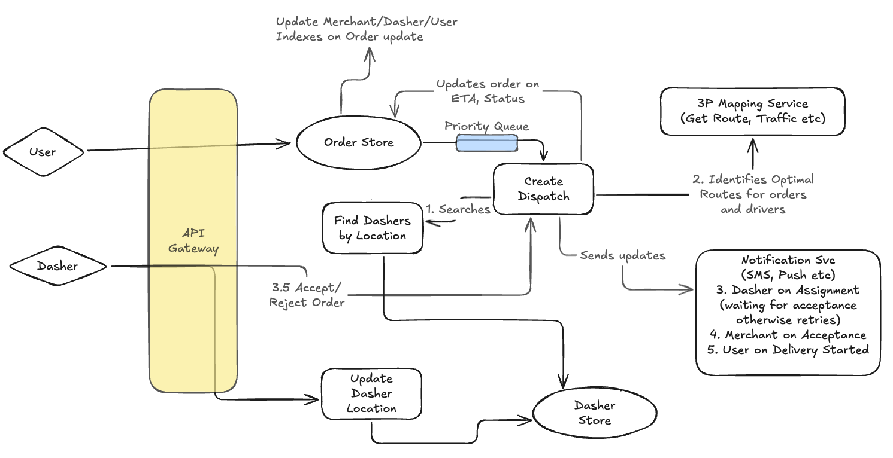

# Design DoorDash's Dispatch Deliver System (DDS)

A Real-Time Delivery Dispatch System ensures that orders are efficiently assigned to delivery drivers while optimizing for speed, cost, and service quality.

---

<D-c>

### Functional Requirements (~2-3 minutes)

Here are the core functional requirements a user (customer, restaurant, Dasher, support agent) would expect:

The functional requirements are:

1. Users will place orders that will be pickedup and made ready-for-pickup by merchants.
2. Once merchants mark it is a ready for pickup, our DDS will find drivers nearby and match the order to a driver.
4. Users can track status of Order and Dasher (location)
5. Dashers update location regularly (say every 5-10 seconds)
6. Dashers can mark stats - available, offline, ontrip etc
7. Dashers can accept/reject orders.
8. Dashers can be assigned multiple orders to pickup in order.

Scale Requirements:

Usage Stats: https://backlinko.com/doordash-users#doordash-usage-statistics

* 3B orders a years (250M Orders a month ~ 8M orders a day)
* 600k businesses
* 50M MAU
* 7M Active Dashers (may be upto 10M now)
* On average - 500 orders per merchant per day (250M / 600k) ~ 50 per hour (assuming 10 hours of operation)
* Peak may be 100 in an hour (note this would need a merchant to have 50 chefs - so this is extreme)

### Extensions (Out of scope)

Functional:

1) Restaurant menu management/search - Assume restaurant onboarding, and menu manageemnt is taken care off.
2) Payment Management - Assume payments, refunds are all taken care off
3) Notification systems (tracking will be live on the page - but email/sms etc not in scope)
4) [Order dispatch system](../delivery_dispatch_system/index.md) - we assume a dasher is assigned automatically (can be designed otherwise)
5) Authentication - we assume a user is logged in (or in the case of guest checkout cookie/session based)
6) Order management - Placing orders by users.
7) Order mutability - Assume orders once created are it (or they can be cancelled in some cases - but we wont deal with
   extra charges on this etc)

Non Functional:
1) Observability - So we can ensure reliability, uptime, attacks etc
2) Disaster recovery - comes under reliabiliability and is a great way to go into which parts are "effectful" and which arent.
3) CI/CD, Deployability, Experimentation

Both:
1) Tiered SLOs (usage/pricing/billing etc)

### Non functional requirements (~2-3 minutes)

* Fault Tolerance, Availability and Durability:
  - System should be available so matching wont stall.
  - Ok for matching to take a slightly bit longer but should be durable
  - Once matched orders cannot be lost
  - order to dasher - 1:1 - no double matching
* Consistency:
  - Eventual consistency is ok for tracking location updates and dasher locations.
* Scalable to our needs with good UX.   Order creations and updates should happen in 200ms (not including payment or external systems).
* Update tracking should be near real-time - Want freshness to be say within 1-5s of updates.

---

## API/Interface/Entities (2-3 minutes)

### Entities
   
```
// User and Dasher are just general entities
record User { id string }
record Dasher {
  Id string   // ID of the dasher 
  LastLocationAt Timestamp
  LastLocation LatLong
  Status enum { Active, Offline, OnTrip }
  Rating float
  VehicleType enum {Bicycle, Car, Scooter}
  
  // List of orders assigned to this driver
  // for example the driver may be asked to do another order if it is on route
  AssignedOrders list<OrderId>
}

record Order {
  Id string
  CreatedAt TimeStmp
  UpdatedAt TimeStmp
  CustomerId string
  RestaurantId string
  DasherId string   // Dasher assigned to this order
  
  Status enum { PLACED, CONFIRMED, COOKING, READY_FOR_PICKUP, DELIVERING, DELIVERED, CANCELLED }
  
  Priority int
  PickupAt LatLong
  DropoffAt LatLong
  
  ETA Timestamp
  RouteInfo any     // Info about the route, start, end, other info
  
  // NOT REQUIRED FOR THIS PROBLEM
  // Only keep the total price
  // Items List<*> // list of items ordered - not important here for matching (or not?)
  // TotalPrice double
  // We may keep payment details here or else where depending on what is visible etc
  // PaymentDetails any
  
  // version etc for OCC
  Version int
}

record OrderItem {
  Id string         // item id
  StoreId string    // which store is this item from
  Name string
  Quantity string
  Price string      // how much the user is paying for it
  Customizations Json   // eg extra onions etc
}

// Dispatch is an LRO
record Dispatch {
  Id string
  OrderId string
}
```

### Services/APIs (~5 minutes)

Now for the APIs/Endpoints needed.

```
service OrdersService {
  GetOrder(orderId string) Order {    // Get details of an order including driver status
    GET /orders/{orderId}
  }
}

service DispatchService {
  CreateDispatch(dispatch Dispatch) Dispatch {    // with Id, Status, CreatedAt, CreatedUser set
    POST "/dispatch"
    body: {dispatch}
  }
}
```

---

## High Level Design (~ 5-10 minutes)



<Drawing id="/hld" preview="./hld.png" width="800px" >High Level Design</Drawing>

Key flows:

1. User places an order - CreateOrder is called (assuming payment successful)
2. Order sent to merchant for preparation - who will mark it as READY_FOR_PICKUP when done.
3. Dispatch service kicks off here.   At this point, order can be sent off to a PQ for dispatching or Dispatch service can poll DB.
4. Meanwhile Dashers are updating location in the [Driver Location Service](../driver_location_service/index.md).
5. Dispatch service gets drivers in a given location so it can rank them.
6. DDS calls routing service to get optimiatl routes, traffic conditions for each of the drivers and sorts them based on some criteria.
7. Adds Order to Driver's list of Orders (but as need to be acked)
8. Driver can accept/reject
9. If Accept, order.DasherId = ... and notified user and merchant.

Another Basic "series of handoffs" problem.

---

## Deep Dives

Now time to go through the deep dive and address concerns.

* All of the above needs to happen fast-ish but only gets kicked off when order is set to READY_FOR_PICKUP.
* May be driver is given 10s to accept/reject.
* Each call needs Location Search, API call to compute route, sort and update Dasher's Order list (and save)
