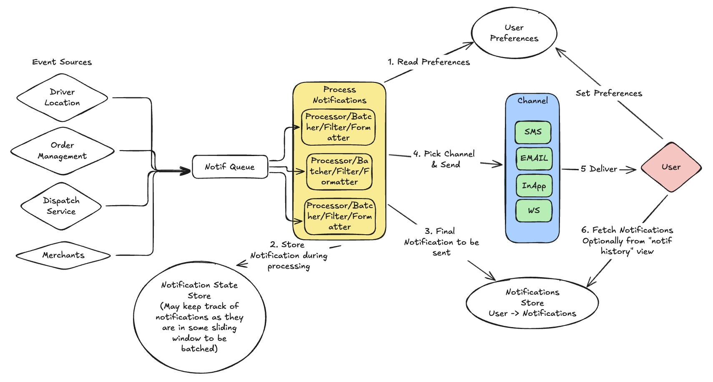

# {{.FrontMatter.title}}

{{ .FrontMatter.summary }}

---

### Functional Requirements (~2-3 minutes)

Here are the core functional requirements a user (customer, restaurant, Dasher, support agent) would expect:

The functional requirements are:

1. Real-Time Notifications for Order Status Changes
  * Users should receive notifications immediately when an order status changes.
  * Order status transitions could include:
  * Order Placed → Confirmation received
  * Order Accepted → Restaurant accepts the order
  * Order Being Prepared → Kitchen starts cooking
  * Order Ready for Pickup → Ready for the delivery partner
  * Out for Delivery → Driver picked up the order
  * Nearby Notification → Driver is close to delivery location
  * Delivered → Order successfully delivered
  Each event should trigger a notification via the preferred communication channel.

2. Multi-Channel Notification Support
  * Users should be able to receive notifications through: Push notifications (iOS/Android), SMS, Email, In-app notifications
  * Users can select their preferred channel(s) in app settings

3. At-Least-Once Delivery Guarantee
  * Notifications should not be lost even if a service temporarily fails.
  * System should retry in case of transient failures (e.g., SMS provider downtime).
  * Duplicate notifications should be avoided with idempotency mechanisms.

4. Rate Limiting and Notification Batching
  * Prevent spam by limiting frequency of notifications.
  * Eg, If multiple events occur within a short window (e.g., 1 minute), they should be batched together.
  * Eg, “Your order is being prepared and will be ready soon” instead of sending multiple updates.

5. Personalization and User Preferences - Though this is assumed to be there
  * Users can opt in/out of specific types of notifications.
  * Example: Some users may want only "Out for Delivery" and "Delivered" notifications.
  * Support granular control per channel (e.g., Push for all updates, SMS for delivery alerts only).

6. Notification Failure Handling and Retries
  * If a notification fails (e.g., email provider outage, SMS undelivered):
    - Retry with exponential backoff.
    - Fallback to another channel if the primary method fails (e.g., SMS if push notification fails).
  * Log failures for debugging. (Out of scope - will treat as part of observability)

7. Prioritization of Critical Notifications
* If the system is under heavy load, critical notifications (e.g., "Out for Delivery") should be prioritized over less critical ones (e.g., "Order is being prepared").
* Implement a priority queue to ensure timely delivery.

### Out of scope

1. Compliance with User Privacy and Legal Regulations
  * Support opt-in/opt-out in compliance with TCPA, GDPR, CCPA.
  * No personally identifiable information (PII) in notifications (e.g., SMS should not contain full address).
  * Store audit logs of notification preferences.

2. Multi-Tenancy (Merchant and Driver Notifications)
  * System should also notify restaurant owners and delivery drivers of relevant events:
  * Restaurants get alerts when a new order is placed.
  * Drivers get notifications for pickup instructions, route changes.

3. Experimentation
  * System should also notify restaurant owners and delivery drivers of relevant events:
  * Restaurants get alerts when a new order is placed.
  * Drivers get notifications for pickup instructions, route changes.

Scale Requirements:

Usage Stats: https://backlinko.com/doordash-users#doordash-usage-statistics

* 3B orders a years (250M Orders a month ~ 8M orders a day)
* 600k businesses
* 50M MAU
* 7M Active Dashers (may be upto 10M now)
* On average - 500 orders per merchant per day (250M / 600k) ~ 50 per hour (assuming 10 hours of operation)
* Peak may be 100 in an hour (note this would need a merchant to have 50 chefs - so this is extreme)

---

## API/Interface/Entities (2-3 minutes)

### Entities
   
```

```

### Services/APIs (~5 minutes)

Now for the APIs/Endpoints needed.

```
service OrdersService {
  GetOrder(orderId string) Order {    // Get details of an order including driver status
    GET /orders/{orderId}
  }
}

service DispatchService {
  CreateDispatch(dispatch Dispatch) Dispatch {    // with Id, Status, CreatedAt, CreatedUser set
    POST "/dispatch"
    body: {dispatch}
  }
}
```

---

## High Level Design (~ 5-10 minutes)



<Drawing id="/hld" preview="./hld.png" width="800px" >High Level Design</Drawing>

Another Basic "series of handoffs" problem.

---

## Deep Dives

Now time to go through the deep dive and address concerns.

* All of the above needs to happen fast-ish but only gets kicked off when order is set to READY_FOR_PICKUP.
* May be driver is given 10s to accept/reject.
* Each call needs Location Search, API call to compute route, sort and update Dasher's Order list (and save)


## **1\. Ensuring Notifications Are Not Lost (Persistence & Durability)**

*Notifications should not be lost even if a service temporarily fails.*

### **Approach: Durable Event Queues \+ Persistent Storage**

* **Use a Reliable Event Queue (Kafka, SQS, Pub/Sub)**  
  * All events should first be published to a **durable, distributed message queue**.  
  * If the **notification service crashes**, the messages remain in the queue and are reprocessed when the service restarts.  
  * Configure **dead-letter queues (DLQ)** to capture unprocessable messages.  
* **Persist Notifications in a Database Before Sending**  
  * Before sending, store each notification in a **persistent data store (PostgreSQL, DynamoDB, Cassandra)**.  
  * Store key attributes:  
    * `message_id`  
    * `user_id`  
    * `channel`  
    * `status` (`PENDING`, `SENT`, `FAILED`, `RETRYING`)  
    * `retry_count`  
  * This allows retry logic to resume even after a crash.

📌 **Example Flow**

1. **Order System** publishes `OUT_FOR_DELIVERY` event → **Event Queue**  
2. **Notification Service** reads event, persists notification in DB → **Marks `PENDING`**  
3. Sends to **Twilio/Firebase** → **Updates status in DB**  
4. If successful, mark `SENT`. If failure, retry.

---

## **2\. Handling Transient Failures with Retries (Fault Tolerance)**

*System should retry in case of transient failures (e.g., SMS provider downtime).*

### **Approach: Exponential Backoff with Circuit Breaker**

* If a **notification fails** due to **network issues, API timeouts, rate limits**, retry **with exponential backoff**:  
  * **1st retry:** 5s  
  * **2nd retry:** 30s  
  * **3rd retry:** 2 min  
  * **4th retry:** 10 min  
* Use a **Circuit Breaker (e.g., Resilience4j, Hystrix)** to detect repeated failures:  
  * If **Twilio SMS API** fails 90% of the time in 5 min → Mark it as **temporarily unavailable**.  
  * Fallback to **Email or Push Notification**.  
* Store retry attempts in the **Notification DB**:  
  * If `retry_count < MAX_RETRIES`, requeue the message.  
  * After `MAX_RETRIES`, send to a **Dead Letter Queue (DLQ)** for manual review.

📌 **Example: Handling Failures with Retries**

1. **Notification Service** sends message via Twilio.  
2. If **Twilio API is down**, **mark as `FAILED`** and retry after backoff.  
3. If still failing, **fallback to another channel** (Push Notification).  
4. If retries exhausted, move to **Dead Letter Queue**.

---

## **3\. Avoiding Duplicate Notifications with Idempotency**

*Duplicate notifications should be avoided with idempotency mechanisms.*

### **Approach: Deduplication with Idempotency Tokens**

* Assign a **`message_id (UUID)`** to each notification **before sending**.  
* Store **sent message IDs in a cache (Redis, DynamoDB, etc.)** with a TTL (e.g., 1 hour).  
* Before sending a notification, check:  
  * If **`message_id` exists** in cache → **Drop it** (Duplicate detected).  
  * If not, proceed and store it in cache.  
* Ensure **external providers (Twilio, Firebase)** use idempotent APIs:  
  * Twilio API supports **Idempotency Keys**: `X-Idempotency-Key: message_id`  
  * Email providers (e.g., AWS SES) use **Message-IDs** to deduplicate.

📌 **Example: Preventing Duplicate Messages**

1. **User closes and reopens app** → Push Notification request **re-sent**.  
2. Check if `message_id` exists in Redis:  
   * ✅ If found, **skip duplicate send**.  
   * ❌ If not found, **send message and store in Redis**.

Since we are now talking about external systems, we cannot do transactions here.

Instead Idempotency-Keys are a great concept so that the external system can be given this key (for example our
message_id as we know we are sending it).  Twilio can ensure that if it receives another message with the same
idempotency key, it will give us back the same response but without actually sending the SMS.
