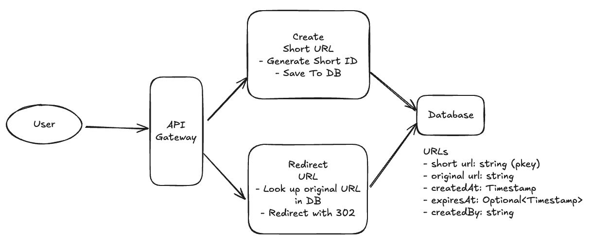

{{# include "DrawingView.html" #}}

# Design Bitly

Bit.ly is a URL shortening service that converts long URLs into shorter, manageable links. It also provides analytics for the shortened URLs.

<testtag></testtag>

## Requirements 222

### Functional Requirements

The functional requirements are:

1.  Users should be able to submit a long URL and receive a shortened version
2.  Users can optionally provide a custom alias and/or expiration for the shortened URL
3.  Users should be able to access the original URL by using the shortened URL

Scale Requirements:

* 1B shortened URLs and 100M DAU

### Non functional requirements

* Ensure short URLs are unique
* Low latency redirection (< 100ms)
* Availability is more important than consistency (4 9s availability)
* Scalable to 1B URLs and 100M DAU

### Extensions (Out of scope)

* Analytics - counts by X
* Authentication/User management

## API/Interface/Entities

```
record URL {
  Id string `primaryKey, unique`
  LongUrl string    
  CreatedBy string
  CreatedAt TimeStmp
  ExpiresAt TimeStamp
}
```

```
service Bitly {
  CreateShortUrl(longUrl string, expiresAt Optional[TimeStamp], alias Optional[string]) (output URL) {
    method: POST
    url: "/urls"
  }
  RedirectUrl(shortUrl string) (shortUrl URL) { 
    method: GET
    // Note /shortUrl is simpler/better than /urls/.... as it mke
    url: "/{shortUrl}
  }
}
```

### High Level Design


<a href="https://excalidraw.com/#json=sHhxf0boLbIl4vQaMOUwG,wpN0an9rUA1i9H_4Csd2CA" target="_blank">Edit</a>


## Deep Dives

Here we will be asked what are the things to dive on and explain how our design addresses requirements.

1. How do we ensure each shortened URL is short and unique

### Option 1: Setup a global counter and increment transactionally on each call

### Option 2: Generate a random K char ID

```
1. set id = alias if one provided
2. if id == "": id = generateShortId()
3. entity := {Id: id, LongUrl: longUrl, Expiration....}
4. db.InsertIfNotExists(entity)
5. if failed: id = "" and goto step   // TODO - Provide # retries
6. return entity


// 6 alnum char gets us 2B IDs
generateShortId(KChars = 6) {
  out = ""
  for range(KChars) {
  out += randomAlphaOrDigit()
  }
  return out
}
```

Writing into this needs a write into the main index (by shortUrl - could be a hash index) followed by a write to a second index by longUrl (a btree index).
Given 10k iops on SSDs, writes could be 50-100ms for both indexes.   May or may not be transactional to tradeoff consistency with Availability.

2. How do you ensure redirects are fast

Main index is hash-index - reads are 1-10 ms.   To get it faster introduce a cache infront of the Database.

3. Further high scale

Imagine load from all over the world.   Here it would be useful to replicate our store to other regions and have traffic from users go to regions closest to them for reads.  Writes would still go to a single region for consistency (otherwise managing global master-master configs are more complicated and expensive).


{{ template "DrawingView" ( dict "caseStudyId" "bitly" "id" "casestudies/bitly/hld" ) }}

