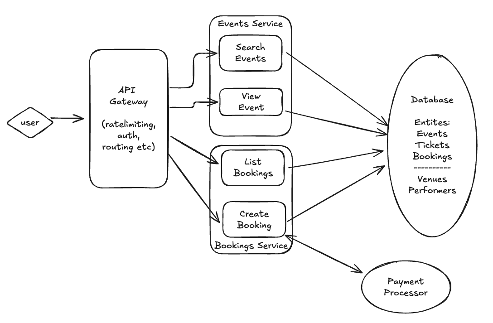

# Design Ticketmaster

{{ .FrontMatter.summary }}

## Requirements (~5 minutes)

### Functional Requirements (~2-3 minutes)

The functional requirements are:

1. User should view/search events
2. User should view availability for events (dates, timings, prices)
3. Users should be able to buy tickets for events (by paying for it!)
4. Users should be able to view their bought tickets

### Extensions (Out of scope)

"Before I go into NFR I want to call out some extensions that I would prefer not being in scope:"

Functional:
1) Admin pages for CRUD events
2) Dynamic Pricing
3) Auditability/Compliance - eg GDPR for protecting user data etc
4) Analytics - eg shows with top views, top purchases etc
5) Authentication/Access Control - user management

Non Functional:
1) Observability - So we can ensure reliability, uptime, attacks etc
2) Disaster recovery - comes under reliabiliability and is a great way to go into which parts are "effectful" and which arent.
3) CI/CD, Deployability, Experimentation

Both:
1) Tiered SLOs (usage/pricing/billing etc)

If this is ok Id like to jump into the NFR and Operational requirements, especially where we deal with SLOs, Latency Targets, Availability, Scalability, Fault tolerance and others.

### Non functional requirements (~2-3 minutes)

* For viewing/searching events - availability is important - user experience
* For purchasing - consistency is higher priority.
* Low latency - 100ms for viewing, 500ms for search
* Scale: 100M DAU, 10ks of events.  Peaks - 10M users viewing details of an event (with
  about 1000 bookings perevent)? for one event.  Also peak bookings (booking in last 5
  mins etc)
* Read heavy - more users viewing/searching events than booking - perhaps 100:1


## API/Interface/Entities (2-3 minutes)

### Entities

```
record User {
  id string
}

record Event {
  // We are treating each session as a "seperate" event.
  // We could have some kind of showId for the "parent show" for which this
  // is an event session
  id string
  venuId string
  createdAt Timestamp
  startTime Timestamp
  endTime Timestamp
  
  
  // Here instead of spots - just have a "Ticket" object
  // For an event even if it says 10k tickets we can just create it once 
  // and be done with - even better more can be added incrementally by admin
  tickets []Ticket
  
  performerIds []string   // All the performers in this event
                          // If we use a "parent show" model we could move it there
                          // for normalization but not needed
  venuId string
}

record Booking {
  id string           // ID for this booking
  userId string       // user making the booking
  createdAt string
  ticketId string     // Which ticket it is associated with
  status string       // status of the booking
  paymentDetails any
}

record Ticket {
  ticketId string               // Primary key
  eventId string                // shard key (if/when we shard or use secondary Index)
  bookingId string | null
  seatInfo any                  // Can also contain other search fields
  price float
  
  reservationExpiryAt TimeStamp // Checks when reservations have expired.
  reservedBy string             // user that reserved it
}

record Venue {
  id string
  name string
  // other deatils about the venue
}

record Performer {
  id string
  name string
  // other deatils about the performer
}

// TBD:
// How to model tickets, we have a Booking for an Event by a user,
// we *could* have this via a Ticket which holds more info like seating, price, etc
// Let us come back to it as we go through the flows
```

### Services/APIs (~5 minutes)

```
service EventsService {
  // Limiting to keyword search - other kinds of searches may need other indexes
  // and design components
  SearchEvents(pageToken string, count int, keywords any) (results []Search, nextPageToken string) {
    GET /events?....
  }
  GetEvent(eventId string) (Event) {
    GET /events/{eventId}
  }
  
  // Only for logged in user
  // Note API is simple to begin with - and paymentDetails is "opaque"
  CreateBooking(eventId: string, ticketId string, paymentDetails: any) Booking {
    POST /event/{eventId}/bookings
  }
}

service Bookings {
  // List bookings for the loggedIn user
  ListBookings() []Booking {
    GET /bookings/
  }
}
```

## High Level Design (~ 5-10 minutes)
[1](1). SearchEvents

<a href="https://excalidraw.com/#json=IffIyQF5jrqvGgS242dut,_TV50kyTsTN56u0-WWjCsQ" target="_blank">Edit_</a>

Remember to add "components" one by one - do a DFS within the HLD as you go through each
use case.


---


### API Walk through

#### SearchEvents

1. User makes a SearchEvents call via API gateway to SearchEvents endpoint.
2. Service fetches events from events table based on keywords (or appropriate indexes)
3. Returns it
4. [Talk during deep dives] - For speedups, use secondary or full-text indexes

#### ViewEvent
1. User makes a ViewEvent call via API gateway to ViewEvent endpoint (by eventId).
2. Service fetches event details (including venue, tickets etc)
3. Returns it and visualizes in the details page - to allow bookings etc

#### CreateBooking

Two ways:

1. Transactionally updates Booking and Event tables with:
  * booking.eventId = event, .status = "PaymentStarted"
  * event.availableSeats --
2. On Payment success, sets booking.status = "PaymentSuccess"
3. On payment failure, transactionally sets the two tables:
  * booking.eventId = nil, status = PaymentDeclined or Failed
  * event.availableSeats++

Option 2:

1. User creates a Booking entry in the Booking table.
2. Marks to Pending
3. Decrements Event.ticket.availableSeats (for the chosen Ticket type)
  * Does this optimistically success availableSeats or == 0 (ie sold out for ticket type)
3. Updates Booking.eventId = eventID and status = "StartedPayment"
4. Kicks off payment flow
5. Updates Booking.status = PaymentSuccessful
6. On failure (or repeated failures) marks Booking.status = Declined or Failed.
7. Garbage collect availableSeats periodically based on how many bookings are in the right
   state.
   
Option 3: 
1. Just find a ticket that is not taken (if user picked it)

Option 3 preferred:
* Tickets can be pre created and  has richer detail and databases can handle multi table
  locks with ease.
Option 1 preferred, because:
1. System is read heavy - even at 100 bookings a second (10M bookings a day), databases
   can handle multi table locks.  (We will talk about sharding later)
  
#### ListBookings

* Lookup bookings by userId (index on bookings)

## Deep Dives and Issues

### Adding reservations

Currently user experience sucks:

1. User could try to buy a ticket that "looks" empty, but when paying could have been
   taken by somebody else.
2. What is needed is reservation of tickets for X minutes.

#### Option 1 - NO GO - Long running locks per row

* Bad for obvious reasons, draining resources in DB etc.

#### Option 2 - Status field with cleanups

We can have a cron job (or update on check) that clears the status field, but this incurs
delays and cron job can fail so may not be reliable.

## Advanced Strategies

#### (Preferred) Option 3 - ReservationExpiration Field

When getting tickets we can filter tickets by:

```
select * from tickets where eventId = X and (reservationExpiryAt is None or reservationExpiryAt < Now())
```

And use the same criteria for OCC updates too.

We can still use a cronjob to "clear" out tickets that are purchased or expired (say move
to another table) - but this cron job reliability wont affect basic functionality (just
will be slower if job isnt working).

#### Option 4 - Use a distributed lock with TTL

+ Lock can be on say ticketId + userId with an expiration.  (Redis great for this).
+ Lock can auto expire
- When fetching tickets - we have to query redis for which locks exist to see which
  tickets are reserved and which reservations are expired.
- Having to use another component is adding more complexity.
- If redis fails - reservations/locks are lost - may not be a big deal but a pain
  nonetheless

## Numerical Analysis for Scale

* Scale: 100M DAU, 10ks of events.  Peaks - 10M users viewing details of an event (with
  about 1000 bookings perevent)? for one event.  Also peak bookings (booking in last 5
  mins etc)
* With 100M DAU - about 1000 QPS across 10k live events - so about 0.1 views per second
  per event (not taking skews into account)

Some numbers

* NumEvents = 10k or even 100k
* NumTickets per event - say 10k
* Total Tickets + Bookings = 10k * 100k = 1B tickets (Ticketmaster sells 500M annually)

* 1B annually = ~ 25 tickets/bookings per second

Write QPS is laughably low - so transaction away


* 100M DAU on views across 100k events
* ~ 1000 View QPS

* 100K events with say 10MB data per event (10k tickets with 1kb per ticket) is 1TB of
* Can be stored be comfortable in a single shard (though doesnt hurt to shard 2-3 ways)
* Taking secondary indexes say 10x

Scale using:
* Loadbalncing across partitions
* Full text indexes - for searches - or better offload to a FTS engine like elastic
* Caching for Views
* 1000 QPS fairly trivial to handle.
* However read amplification may be an issue - eg a search can return say 20 events.   We
  just may want 20 event "high level" details.
* Shard (if needed) by eventId - so colocate all event data in a single shard or even a
  single doc in a doc DB.  This means getting all tickets in a single KV lookup.   Or we
  can really do "ticket groups" within an event and that becomes a decent sharding point.
  We really dont need to lock an event - just the tickets.

## Handling High load on Seat Map

For popular events large view events means seat map can may show up as available but could
be clicked by somebody else quickly.   Not incorrect just annoying.

Couple of options:

1. Instead of doing a reservation - put reservations in a "queue" and notify users when
   reservations go through or tell them that they are in the queue and will be notified.
   This way when reservations expires - next user will be given it and notified (with a
   timer too).
2. Have a SSE connection on the page that shows them seat changes in real time.  Not ideal
   as hot events can start with a "red" map first and they would have to be seated in
   there.
